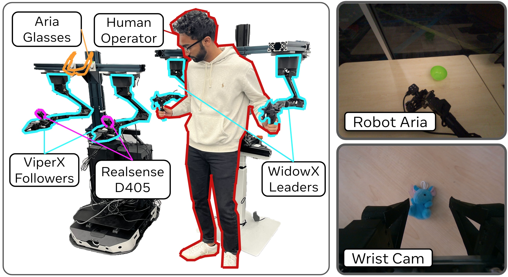

# EgoMimic - Eve

Hardware repo for our work EgoMimic: Scaling Imitation Learning Via EgoCentric Videos.  To train imitation learning policies, or to collect human embodiment data via Aria glasses, see the main [EgoMimic repo](https://github.com/SimarKareer/EgoMimic).

[Project Page](https://egomimic.github.io/) | [Hardware Assembly Doc](https://docs.google.com/document/d/1ac5yN-IIRzRgKeJleBk5XEHwk4tcsTsFBDvItDau1Nk/edit?tab=t.0#heading=h.axwpytr6n3bk)

Eve is the robot that powers EgoMimic.  We built Eve to learn from <u>E</u>gocentric <u>V</u>ideos <u>E</u>ffortlessly.  

This codebase interfaces with all of Eve's hardware components.  It contains the ROS setup to interface with the ViperX arms and supports using Aria Glasses as part of ROS.  It also contains [``scripts``](./scripts/) to collect teleoperated demonstrations on Eve.  We fork off of the Aloha ROS2 implementation from [Trossen](https://github.com/Interbotix/aloha.git).

Tested
- :white_check_mark: Ubuntu 22.04 + ROS 2 Humble


## Structure
- [``eve``](./eve/): Python package providing useful classes and constants for teleoperation and dataset collection.  Contains scripts to use Aria glasses with ROS node (`stream_aria_ros.py`)
- [``hardware``](./hardware/): Contains CAD designs for all EgoMimic hardware, including Aria glasses mounts, Arm mounts, and gripper.
- [``config``](./config/): a config for each robot, designating the port they should bind to, more details in quick start guide.
- [``launch``](./launch): a ROS 2 launch file for all cameras and manipulators.
- [``scripts``](./scripts/): Python scripts for teleop and data collection


## Install instructions
Build all of this without a conda environment in `~/interbotix_ws`
1. Set up ROS2, interbotix packages, and realsense cameras via the [(Trossen Instructions)](https://docs.trossenrobotics.com/aloha_docs/getting_started/stationary/software_setup.html).  But critically under the step for [Aloha Software Installation](https://docs.trossenrobotics.com/aloha_docs/getting_started/stationary/software_setup.html#aloha-software-installation), make sure to clone this repo instead

```
IGNORE: git clone https://github.com/Interbotix/aloha.git
git clone git@github.com:SimarKareer/eve.git
```

2. Setup Aria Glasses [Aria Instructions](https://facebookresearch.github.io/projectaria_tools/docs/ARK/sdk/setup).  In brief you just need to run
```
python3 -m pip install projectaria_client_sdk --no-cache-dir
aria-doctor
aria auth pair (then open mobile app and approve)
```
3. Install extra packages
```
pip install opencv-python fastplotlib==0.1.0a13 glfw==2.6.2 pyg==0.1.14 dm_env h5py ipython
```
4. Add permissions on video cams
```
sudo usermod -a <user> -G video
```
5. Add aliases to `~/.bash_aliases`
```
alias setup_eve="source /opt/ros/humble/setup.bash && source ~/interbotix_ws/install/setup.bash"
alias ros_eve="ros2 launch eve aloha_bringup.launch.py"
```
6. Restart machine

7. If facing issues, build realsense ros package from scratch, I used this [commit](https://github.com/IntelRealSense/realsense-ros/commit/7c163180e56172f38700d9f3ac9a4205de03765e)

### Tips
- Use a standard terminal instead of vscode.
- Any time changes are made to the ROS package, you must run `colcon build` in `~/interbotix_ws`
- ros2 run rqt_reconfigure rqt_reconfigure


## Usage
To start up ROS run
```
setup_eve
ros_eve
```

To ensure all camera sensors are functional launch Rviz
```
rviz2
```

Occasionally Aria fails to connect, simply restart the computer and it should connect fine.

## Data Collection / Teleop Scripts
For data collection and teleop we'll continue to use the base python installation (no conda env)

### Teleoperation
```
python scripts/dual_side_teleop.py --arm <left, right, both>
```

### Data Collection
First, define a task in `eve/constants.py`.  After adding this you'll need to rebuild via `colcon build`.  Then run
```
python scripts/dual_side_teleop.py --arm <left, right, both> --task_name <task name>
```


## Other Stuff
setting in aloha_vx300s.yaml, figure out how to make this change in the other yaml so I don't have to edit the interbotix repo

```
  shoulder_shadow:
    ID: 3
    Baud_Rate: 3
    Return_Delay_Time: 0
    Drive_Mode: 2
    Velocity_Limit: 131
    Min_Position_Limit: 841
    Max_Position_Limit: 2867
    Secondary_ID: 255

```